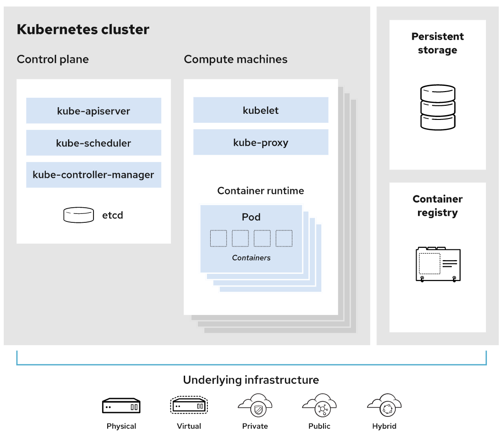
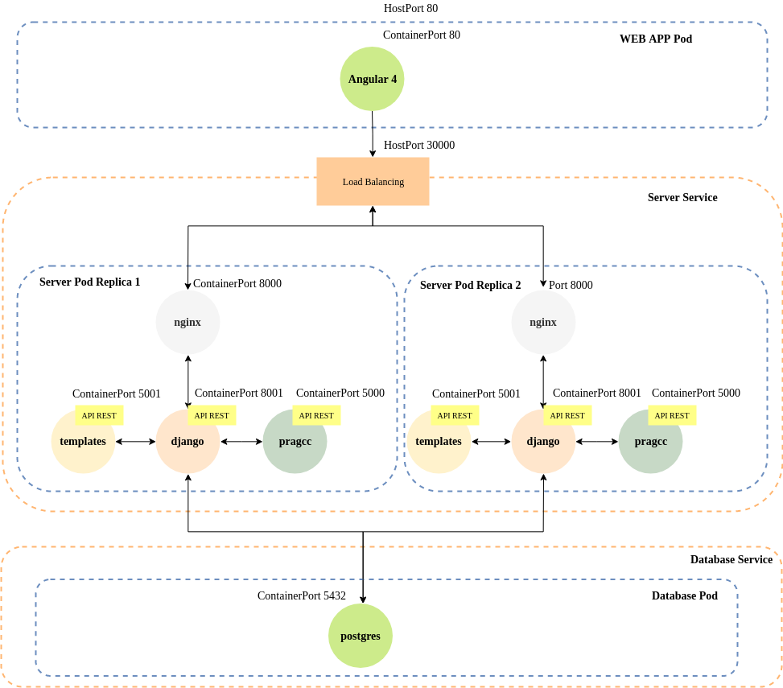

# Descripción del demo para el ascenso de categoría asistente a asociado

---

## Introducción

### Kubernetes

- Ejecución de un entorno  de Kubernetes.
  </img>
*Tomado de: [What is Kubernetes](https://www.redhat.com/en/topics/containers/what-is-kubernetes)*

- Para efectos del demo se decidió usar [minikube](https://minikube.sigs.k8s.io/docs/). Una vez descargado se ejecuta `minikube start`

- Validar que está funcionando adecuadamente el entorno de Kubernetes, `kubectl get pods -A`

```
NAMESPACE     NAME                               READY   STATUS    RESTARTS        AGE
kube-system   coredns-64897985d-lmh9f            1/1     Running   1 (12h ago)     13h
kube-system   etcd-minikube                      1/1     Running   1 (12h ago)     13h
kube-system   kube-apiserver-minikube            1/1     Running   1 (12h ago)     13h
kube-system   kube-controller-manager-minikube   1/1     Running   1 (12h ago)     13h
kube-system   kube-proxy-57dxl                   1/1     Running   1 (12h ago)     13h
kube-system   kube-scheduler-minikube            1/1     Running   1 (12h ago)     13h
kube-system   storage-provisioner                1/1     Running   3 (8m59s ago)   13h
```

**IMPORTANTE** conocer el IP donde corre `minikube` &rarr; `minikube ip`. En mi caso es `192.168.49.2`.

---

## Ejecución de la aplicación

### Comandos a ejecutar para despliegue de los contenedores

En el directorio donde se descargó el repositorio [coder](https://github.com/DonAurelio/coder) copiar el archivo `start_app.sh` y ejecutarlo `./start_app.sh`.
Este script levantará los siguientes objetos del aplicativo:

- `Pod` con la **base de datos**
- `Service` para permitir el acceso a la base de datos
- `ReplicationController` para ejecutar **servidores del aplicativo** bajo un esquema de réplica.
- `Service` para permitir que el servidor sea accedido
- `Pod` donde se encuentra **la interfaz de usuario**

  </img>

---

### Validación que la aplicación está operando

Una vez ejecutado el script `start_app.sh` se valida que el aplicativo este corriendo. 
Se ejecuta `kubectl get pods,rc,services` 

```
NAME                        READY   STATUS    RESTARTS   AGE
pod/coder-database-pod      1/1     Running   0          12s
pod/coder-server-rc-29j4r   4/4     Running   0          9s
pod/coder-server-rc-n9tng   4/4     Running   0          9s
pod/coder-webapp-pod        1/1     Running   0          7s

NAME                                    DESIRED   CURRENT   READY   AGE
replicationcontroller/coder-server-rc   2         2         2       9s

NAME                         TYPE        CLUSTER-IP     EXTERNAL-IP   PORT(S)          AGE
service/coder-database-svc   ClusterIP   10.98.85.35    <none>        5432/TCP         11s
service/coder-server-svc     NodePort    10.98.15.106   <none>        8000:30000/TCP   8s
service/kubernetes           ClusterIP   10.96.0.1      <none>        443/TCP          13h
```

---

### Creando datos para demostración

Una vez el ambiente este funcional entonces se crean datos en la base de datos. 
Se accede vía SSH a uno de los pods que tiene corriendo el server.
En este caso se usará el servidor llamado `coder-server-rc-n9tng`.

Para acceder al servidor se ejecuta:
```
kubectl exec -it coder-server-rc-n9tng -c django -- sh
```

Una vez dentro del servidor se ejecuta el siguiente comando:
```
./manage.py loaddata sampledb-compose.json
```

Esto crea datos en la base de datos para llevar a cabo una demostración básica del aplicativo.


---

## Demostración

- La aplicación se accede a través de un API REST. 
- Se consultarán por los proyectos que están disponibles en la plataforma 

`curl --request GET -H "Accept: application/json" http://192.168.49.2:30000/api/project/projects/ | jq -r`

- El resultado esperado debe ser algo como esto:

``` 
{
  "meta": {
    "limit": 100,
    "next": null,
    "offset": 0,
    "previous": null,
    "total_count": 1
  },
  "objects": [
    {
      "base_template": "stencil",
      "created_at": "2019-08-12T14:01:45.294000",
      "description": "This is a hellow world example",
      "id": 1,
      "name": "Example 1",
      "resource_uri": "/api/project/projects/1/"
    }
  ]
}
``` 

Hay un proyecto llamado **Example 1**

---

### Obtención del código fuente del proyecto Example 1

Para recuperar el código en C del proyecto se ejecuta el siguiente comando:
```
curl --request GET -H "Accept: application/json" http://192.168.49.2:30000/api/project/files/ | jq -r '.objects[0].text' > demo.c
```

Ahora, se puede acceder al archivo `demo.c` en el directorio donde ejecutó el comando anterior.
Este es un programa para autómatas celulares básico.

Ahora, se recupera el *stencil* o patrón para el procesamiento de los datos en la malla o arreglo.

```
curl --request GET -H "Accept: application/json" http://192.168.49.2:30000/api/project/files/ | jq -r '.objects[1].text' > stencil.c
```

Observando el contenido del archivo `stencil.c` se observa lo siguiente. 
Ciclos **2** y **4** se deben paralelizar. 

```
version: 1.0 
name: 'stencil'
description: |
    Template with stencil parallel programming pattern.
    support OpenMP loop coarse grain parallelization and OpenACC fine
    grain parallelization.
functs:
  all:
    - main
    - initialize
    - function
    - neighborhood
    - evolve
  parallel:
    evolve:
      mp: 
        parallel_for:
          - nro: 2
            clauses:
              num_threads: 4
          - nro: 4
            clauses:
              num_therads: 4
```

---

### Paralelización del código fuente del proyecto Example 1


Para paralelizar el código, a partir de los archivos de la sección anterior, se ejecuta lo siguiente:

```
curl --request POST http://192.168.49.2:30000/api/pragcc/openmp/parallelize/files/1 | jq -r '.text' > salida.c
```


---

## Detención de la ejecución de la aplicación

Para detener la aplicación se ejecuta `./stop_app.sh`
